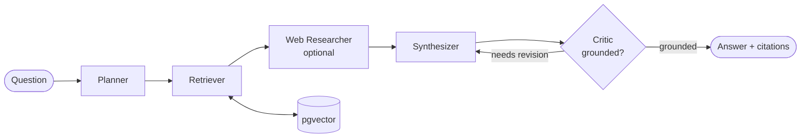

# Agentic Knowledge Engine (RAG MCP)

[](https://github.com/anujbolewar/Agentic-Knowledge-Engine/actions/workflows/ci.yml)
[](https://www.python.org/)
[](https://modelcontextprotocol.io)

A **multi-agent Retrieval-Augmented Generation (RAG) system** packaged as an **MCP server**.
Ask a question and it plans, retrieves evidence from a vector store, and returns a cited answer.

It plugs into any MCP client (Claude Code, Cursor, Windsurf, ...) as three tools:
`ingest`, `ask`, and `search`.

## Architecture



| Agent | Responsibility |
|---|---|
| **Planner** | Break the question into search queries |
| **Retriever** | Cosine top-k over pgvector |
| **Web Researcher** | Optional live web results (Firecrawl) |
| **Synthesizer** | Draft a cited answer |
| **Critic** | Check grounding; loop back for revision if unsupported |

## The three MCP tools

| Tool | Arguments | Returns |
|---|---|---|
| `ingest` | `url: str` | Scrapes, chunks, embeds, stores. `{ url, chunks_added }` |
| `ask` | `question: str` | Full pipeline. `{ answer, citations, plan, grounded }` |
| `search` | `query: str, k: int = 5` | Top-k chunks with similarity scores |

## Quickstart

```bash
# 1. Install (Python 3.10+)
uv venv && uv pip install -e ".[dev]"

# 2. Configure
cp .env.example .env     # add ANTHROPIC_API_KEY, VOYAGE_API_KEY, DATABASE_URL

# 3. Create the vector table
psql "$DATABASE_URL" -f sql/schema.sql

# 4. Run the MCP server (stdio by default)
agentic-rag-mcp
```

Wire it into Claude Code:

```bash
claude mcp add agentic-rag -s user \
  --env ANTHROPIC_API_KEY=sk-ant-... \
  --env VOYAGE_API_KEY=pa-... \
  --env DATABASE_URL=postgresql://... \
  -- agentic-rag-mcp
```

Then: *"ingest https://example.com/docs"* → *"ask: how do I configure X?"*

## How it works

1. **Plan** — Claude turns the question into focused search queries.
2. **Retrieve** — each query is embedded and matched against pgvector by cosine distance.
3. **Research** — optional live web results are appended (if `FIRECRAWL_API_KEY` is set).
4. **Synthesize** — Claude writes an answer grounded only in the numbered context, citing each as `[n]`.
5. **Critique** — a fact-check pass revises the answer until every claim is supported.

Tunable env vars: `RAG_MODEL`, `RAG_TOP_K`, `RAG_MAX_REVISIONS`, `RAG_EMBED_MODEL`.

## Evaluation

Answer quality is enforced in CI with a golden dataset (`evals/golden.yaml`) run through the
real pipeline — planner, retriever, synthesizer, self-critique. Nothing is mocked; a regression
fails the build.

```bash
python evals/seed.py --schema --reset   # seed the corpus
make eval                               # run the suite locally
```

## Deploy

Containerised for [Railway](https://railway.app) (HTTP transport):

```bash
railway up        # set RAG_TRANSPORT=http
```

Production-shaped Kubernetes manifests live in `deploy/k8s/`.

## Project layout

```
src/agentic_rag_mcp/
  config.py       # env-driven settings
  llm.py          # Claude helper + JSON parsing
  embeddings.py   # Voyage embeddings
  store.py        # pgvector store (psycopg)
  web.py          # Firecrawl web research (optional)
  ingest.py       # chunking + ingestion
  state.py        # LangGraph state
  nodes.py        # planner / retriever / synthesizer / critic
  graph.py        # graph assembly
  tracing.py      # opt-in OpenTelemetry
  server.py       # FastMCP server (ingest / ask / search)
evals/            # golden dataset + corpus + promptfoo suite
deploy/k8s/       # Kubernetes manifests
sql/schema.sql    # pgvector schema
```